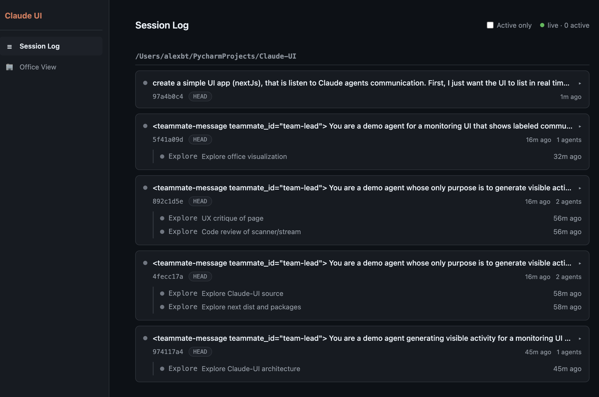
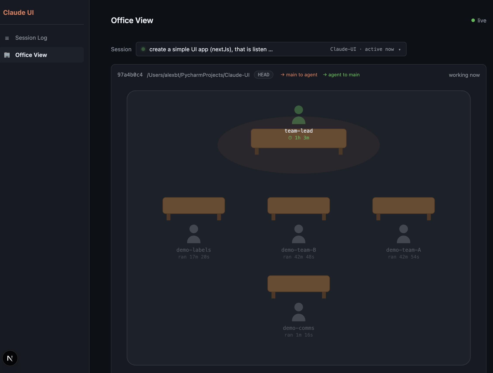

# Claude Agent Monitor

A real-time dashboard for watching [Claude Code](https://claude.com/claude-code) sessions and their agents work.

Claude Code writes every session, subagent, and teammate transcript to `~/.claude/projects/`. This app watches those files and turns them into two live views:

- **Session Log** — all sessions grouped by project, with their agents nested under them. Active sessions/agents pulse green; every session is expandable to show its full conversation trace (user messages, assistant replies, tool calls) streaming in real time.

  

- **Office View** — pick a session and see it as a small office: the main agent at the front desk, every teammate and subagent at their own desk with a live running clock. Animated, labeled arrows show communication flowing between them (messages, spawns, tool activity) as it happens.

  

Everything is read-only: the app never talks to Claude or modifies any files — it only tails transcripts.


## Requirements

- **Node.js 18.18+** (Node 20+ recommended) and **npm**
- **Claude Code** installed and used at least once (the app reads `~/.claude/projects/`; without it there is simply nothing to show)
- macOS or Linux (any platform where `~/.claude/projects` exists)

Runtime dependencies are just Next.js and React (installed via npm):

| Package | Version |
|---|---|
| next | ^15.3 |
| react / react-dom | ^19 |
| typescript (dev) | ^5 |

## Getting started

```bash
git clone https://github.com/alexbt/claude-ui
cd claude-ui
make install        # npm install
make dev            # launch at http://localhost:3000
```

Then open **http://localhost:3000**. Start a Claude Code session (or spawn agents/teammates) in any terminal and watch it appear within a couple of seconds.

### Makefile targets

| Target | What it does |
|---|---|
| `make install` | install dependencies |
| `make dev` | run in development mode with hot reload (port 3000) |
| `make build` | production build |
| `make start` | serve the production build (`make build` first) |
| `make clean` | remove build artifacts (`.next`, TS build cache) |

Without make: `npm install`, then `npm run dev`.


## How it works

```
~/.claude/projects/<project>/<session-id>.jsonl          ← session transcripts
~/.claude/projects/<project>/<session-id>/subagents/     ← subagent transcripts
        agent-<id>.jsonl + agent-<id>.meta.json
```

- `lib/scanner.ts` scans this tree and builds a snapshot: projects → sessions (first prompt, git branch, teammate name/team) → agents (type, description, activity). "Active" means the transcript was written in the last 60 seconds. Recent transcript tails are parsed for communication events (teammate messages, `SendMessage`/`Agent` tool calls, current tool usage).
- `app/api/stream/route.ts` polls the scanner every 2s and pushes snapshots to the browser over Server-Sent Events (only when something changed; one shared scan across all clients).
- `app/api/trace/route.ts` streams a session's full conversation, then tails the file by byte offset for live updates.
- Named teammate agents run as sibling sessions; they are linked back to their spawning session via the `teamName` field in the transcript, which is how the office view seats them together.


## Notes & limitations

- Activity is inferred from file writes: a session idle at the prompt (waiting for user input) shows as **inactive** after ~60 seconds even though its process is alive.
- Communication arrows and labels come from transcript tails within a ~90-second window — they visualize recent flow, not the full message history (the trace panel has that).
- The office view shows up to 12 desks per session; extras are counted below the scene.
